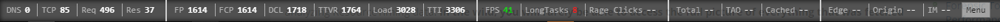
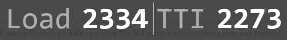

# PerfBar (TamperMonkey script)

Adds a floating toolbar with performance data for every site you visit.

Powered by [Boomerang](https://github.com/SOASTA/boomerang)

There are two versions of the toolbar:

`perfbar.user.js` shows the following:

`perfbar-min.user.js` shows just the Load Time and Time to Interactive:

Install via [TamperMonkey](https://tampermonkey.net)

## Credits

* Charie Vazac
* Nic Jansma